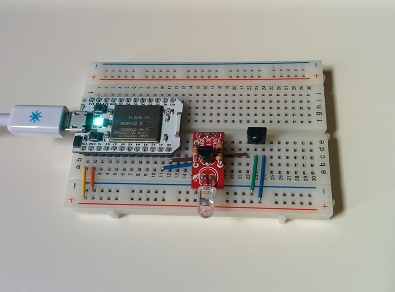

spirkctrl
=========

Simple IR learning and transmitting for SparkCore

### Working Final Breadboard design

### Details

As you can see from the image I'm using a standard IR reciever which doesn't
filter out the carrier, clearly there is enough capacitance in the circuit that
it didn't matter and it got filtered out (perhaps simply by using the A0 pin).
In any case you will get a far better signal read if you use one of the 38kHz
tuned IR receivers - although I've not yet had any problem.

I bought the little IR transmitter board as a kit but as you can see it's a
very simple transistor to switch 5V, I just thought this was neater and is a
little thing I'd reuse quite a lot (and it cost the same as just the IR LED on
its own from my local electronics store).

For what it's worth at some point I'll add a fritzing diagram of the circuit.

### Learning

Due to limitations on how much data can be sent through the SparkCore cloud I
went for the very simple solution of outputting learnt sequences on the serial
port which I then copy&paste into <code>const unsigned int</code> arrays in the
code and then hit <code>flash</code>. To me this seemed the simplest solution,
I have no need to program/send/understand IR codes - it's not like I
install/change my aircon or AV equipment very often (I will be adding
<code>power on</code> and <code>power off</code> for my AV amp soon as I like
the idea of having it turn on when I get home so my Chromecast is ready to rock
and roll so I can move my music from the car to the amp as I walk in the
door).

### Operation

To learn a new code, first plug the SparkCore into a computer using the microusb
cable and get a serial connection working. I use Linux so I do this like so:

    $ screen /dev/ttyACM0 115200

Next send the learn command to the SparkCore via the cloud (get your SPARK_ID and
API_TOKEN from http://spark.io/build/):

    $ curl https://api.spark.io/v1/devices/SPARK_ID/learn -d access_token=API_TOKEN

You will then see the serial:

    Send IR now:

You have 10 seconds to send the IR code after which you will see the following:

    Recv: (72, 0);
    
    datapoints ... : 72
    overflow ..... : 0
    Raw data:
    38634373/38643389/38647883/38648434/38649009/38649564/38650140/38650693/38651269/38651823/38653503/38654056/38655735/38656289/38657968/38658522/38660201/38660755/38661329/38661885/38663563/38664117/38665795/38666350/38668027/38668583/38669155/38669713/38670285/38670842/38671415/38671972/38672545/38673101/38674779/38675334/38675907/38676464/38677038/38677593/38679271/38679826/38681503/38682059/38682632/38683188/38683762/38684318/38685995/38686551/38688229/38688784/38690460/38691017/38692693/38693250/38693822/38694379/38694951/38695509/38697185/38697742/38699417/38699975/38700546/38701104/38701677/38702234/38742011/38750985/38753242/38753797/
    Calculated Period data (copy this one):
    9016,4494,551,575,555,576,553,576,554,1680,553,1679,554,1679,554,1679,554,574,556,1678,554,1678,555,1677,556,572,558,572,557,573,557,573,556,1678,555,573,557,574,555,1678,555,1677,556,573,556,574,556,1677,556,1678,555,1676,557,1676,557,572,557,572,558,1676,557,1675,558,571,558,573,557,39777,8974,2257,555,0

If overflow is not 0 it means data was lost and you should try again (perhaps you
held the key down for too many repeats, try to press it quickly). If overflow is
less then 50 you could try increasing <code>MAXLEN</code> but it more than likely
means the filtering of the carrier signal has failed.

You can then copy&paste the <code>Calculated Period data</code> into a new
<code>const unsigned int</code> array at the top of the code and add a call
to <code>_playSequence()</code> in <code>doReplay</code> and then reflash
the SparkCore. You can then replay the sequence via the following command
(e.g. this will replay the <code>airHeatOn</code> array sequence):

    $ curl https://api.spark.io/v1/devices/SPARK_ID/replay -d access_token=API_TOKEN -d "args=heaton"

Enjoy.
